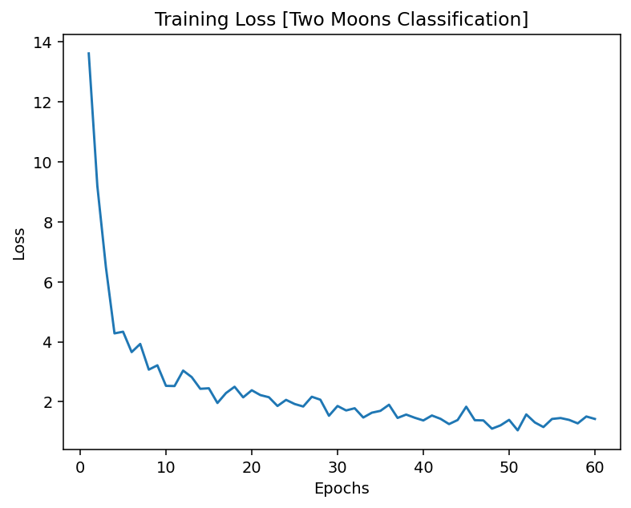
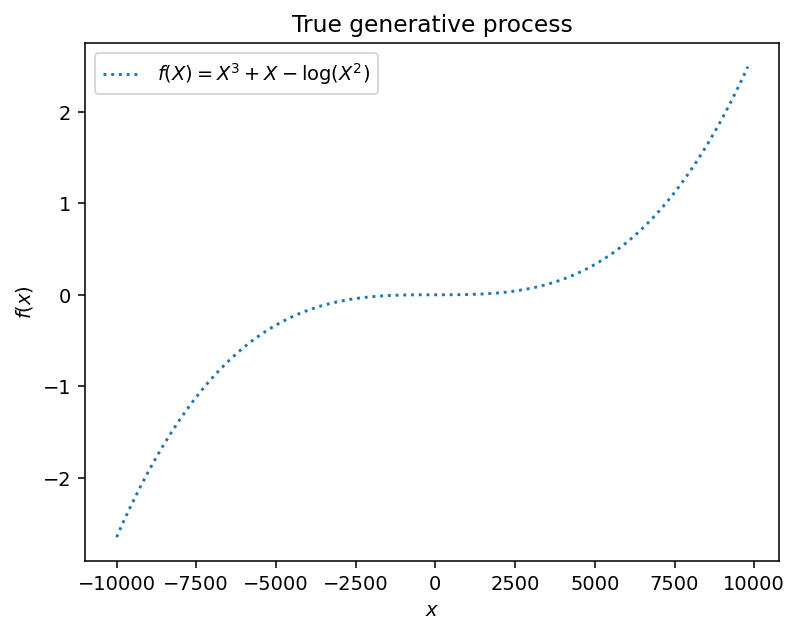
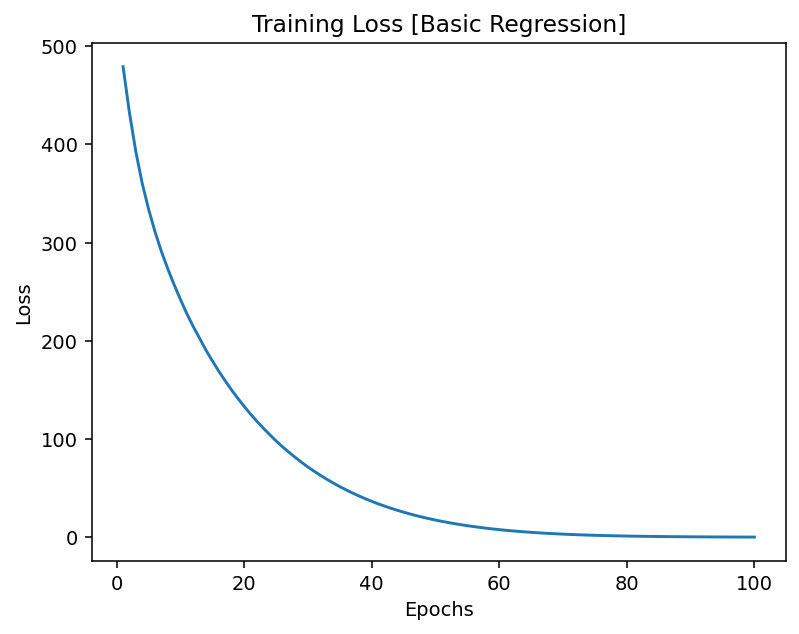
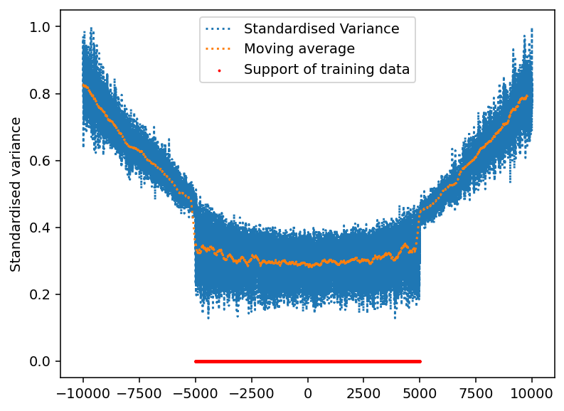
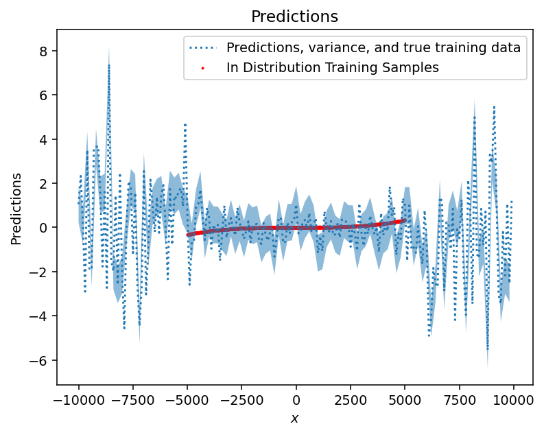
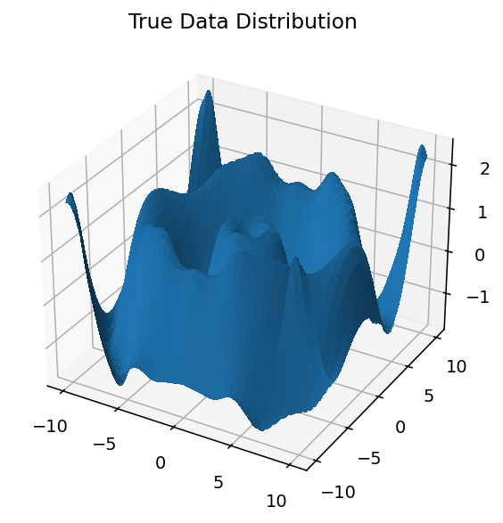
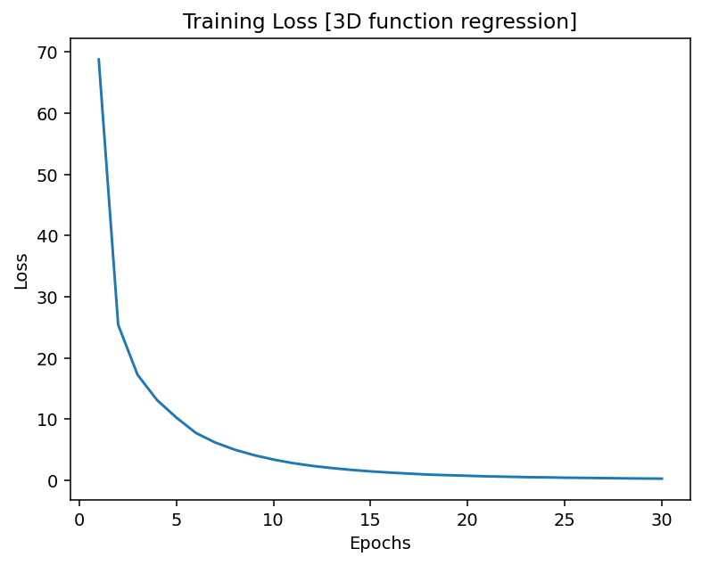
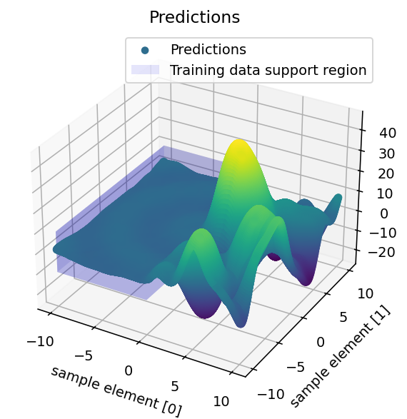
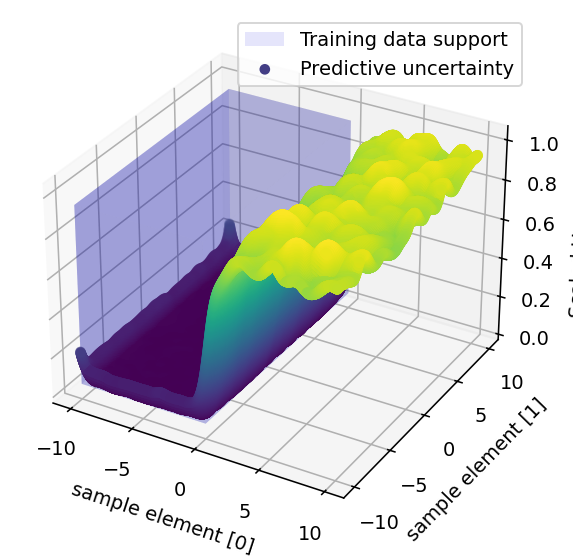

# PyTorch Implementation of SNGP

The core concepts of **Spectral-normalised Neural Gaussian Process** (SNGP) can be found in the original paper https://arxiv.org/abs/2006.10108. SNGP's main idea is to improve the ability of deep neural networks to retain distance information and to leverage this to determine the distance between test examples and the training data to improve predictive uncertainty estimates.
This notebook roughly follows the outline of https://colab.research.google.com/github/tensorflow/docs/blob/master/site/en/tutorials/understanding/sngp.ipynb but aims to implement all functionality shown here in PyTorch. https://github.com/alartum/sngp-pytorch is also an excellent implementation to consider and was read in determining how to organise my implementation.


```python
import matplotlib.pyplot as plt
import matplotlib.colors as colors
import numpy as np
import torch
import sklearn.datasets
from torch.utils.data import Dataset
import logging

logger = logging.getLogger(__name__)
```

Define visualization macros


```python
plt.rcParams['figure.dpi'] = 140

DEFAULT_X_RANGE = (-3.5, 3.5)
DEFAULT_Y_RANGE = (-2.5, 2.5)
DEFAULT_CMAP = colors.ListedColormap(["#377eb8", "#ff7f00"])
DEFAULT_NORM = colors.Normalize(vmin=0, vmax=1,)
DEFAULT_N_GRID = 100
```


```python
# Show logs
logging.basicConfig(level=logging.INFO)
```

## The two moon dataset
Create the trainining and evaluation datasets from the [two moon dataset](https://scikit-learn.org/stable/modules/generated/sklearn.datasets.make_moons.html).


```python
def make_training_data(sample_size=500):
  """Create two moon training dataset."""
  train_examples, train_labels = sklearn.datasets.make_moons(
      n_samples=2 * sample_size, noise=0.1)

  # Adjust data position slightly.
  train_examples[train_labels == 0] += [-0.1, 0.2]
  train_examples[train_labels == 1] += [0.1, -0.2]

  return train_examples, train_labels
```

Evaluate the model's predictive behavior over the entire 2D input space.


```python
def make_testing_data(x_range=DEFAULT_X_RANGE, y_range=DEFAULT_Y_RANGE, n_grid=DEFAULT_N_GRID):
  """Create a mesh grid in 2D space."""
  # testing data (mesh grid over data space)
  x = np.linspace(x_range[0], x_range[1], n_grid)
  y = np.linspace(y_range[0], y_range[1], n_grid)
  xv, yv = np.meshgrid(x, y)
  return np.stack([xv.flatten(), yv.flatten()], axis=-1)
```

To evaluate model uncertainty, add an out-of-domain (OOD) dataset that belongs to a third class. The model never sees these OOD examples during training.


```python
def make_ood_data(sample_size=500, means=(2.5, -1.75), vars=(0.01, 0.01)):
  return np.random.multivariate_normal(
      means, cov=np.diag(vars), size=sample_size)
```


```python
# Load the train, test and OOD datasets.
train_examples, train_labels = make_training_data(
    sample_size=500)
test_examples = make_testing_data()
ood_examples = make_ood_data(sample_size=500)

# Visualize
pos_examples = train_examples[train_labels == 0]
neg_examples = train_examples[train_labels == 1]

plt.figure(figsize=(7, 5.5))

plt.scatter(pos_examples[:, 0], pos_examples[:, 1], c="#377eb8", alpha=0.5)
plt.scatter(neg_examples[:, 0], neg_examples[:, 1], c="#ff7f00", alpha=0.5)
plt.scatter(ood_examples[:, 0], ood_examples[:, 1], c="red", alpha=0.1)

plt.legend(["Postive", "Negative", "Out-of-Domain"])

plt.ylim(DEFAULT_Y_RANGE)
plt.xlim(DEFAULT_X_RANGE)

plt.show()
```


    

    


Here the blue and orange represent the positive and negative classes, and the red represents the OOD data. A model that quantifies the uncertainty well is expected to be confident when close to training data  (i.e., $p(x_{test})$ close to 0 or 1), and be uncertain when far away from the training data regions  (i.e., $p(x_{test})$ close to 0.5).


```python
class TrainDataset(Dataset):
  def __init__(self, X, y, dtype_X = torch.FloatTensor, dtype_y = torch.LongTensor):
    self.train_examples = torch.from_numpy(X).type(dtype_X)
    self.train_labels = torch.from_numpy(y).type(dtype_y)

  def __len__(self):
    return len(self.train_examples)

  def __getitem__(self, idx):
    return self.train_examples[idx], self.train_labels[idx]
```


```python
logger.info(f"{train_examples.shape=}, {train_labels.shape=}")
```

    INFO:__main__:train_examples.shape=(1000, 2), train_labels.shape=(1000,)


### Visualize uncertainty

The following code for plotting the classification and uncertainty surface can be found at https://colab.research.google.com/github/tensorflow/docs/blob/master/site/en/tutorials/understanding/sngp.ipynb#scrollTo=HZDMX7gZrZ-5.


```python
def plot_uncertainty_surface(test_uncertainty, ax, cmap=None):
  """Visualizes the 2D uncertainty surface.

  For simplicity, assume these objects already exist in the memory:

    test_examples: Array of test examples, shape (num_test, 2).
    train_labels: Array of train labels, shape (num_train, ).
    train_examples: Array of train examples, shape (num_train, 2).

  Arguments:
    test_uncertainty: Array of uncertainty scores, shape (num_test,).
    ax: A matplotlib Axes object that specifies a matplotlib figure.
    cmap: A matplotlib colormap object specifying the palette of the
      predictive surface.

  Returns:
    pcm: A matplotlib PathCollection object that contains the palette
      information of the uncertainty plot.
  """
  # Normalize uncertainty for better visualization.
  test_uncertainty = test_uncertainty / np.max(test_uncertainty)

  # Set view limits.
  ax.set_ylim(DEFAULT_Y_RANGE)
  ax.set_xlim(DEFAULT_X_RANGE)

  # Plot normalized uncertainty surface.
  pcm = ax.imshow(
      np.reshape(test_uncertainty, [DEFAULT_N_GRID, DEFAULT_N_GRID]),
      cmap=cmap,
      origin="lower",
      extent=DEFAULT_X_RANGE + DEFAULT_Y_RANGE,
      vmin=DEFAULT_NORM.vmin,
      vmax=DEFAULT_NORM.vmax,
      interpolation='bicubic',
      aspect='auto')

  # Plot training data.
  ax.scatter(train_examples[:, 0], train_examples[:, 1],
             c=train_labels, cmap=DEFAULT_CMAP, alpha=0.5)
  ax.scatter(ood_examples[:, 0], ood_examples[:, 1], c="red", alpha=0.1)

  return pcm
```


```python
def plot_predictions(pred_probs, uncertainty, model_name=""):
  """Plot normalized class probabilities and predictive uncertainties."""
  # Compute predictive uncertainty.

  # Initialize the plot axes.
  fig, axs = plt.subplots(1, 2, figsize=(14, 5))

  # Plots the class probability.
  pcm_0 = plot_uncertainty_surface(pred_probs, ax=axs[0])
  # Plots the predictive uncertainty.
  pcm_1 = plot_uncertainty_surface(uncertainty, ax=axs[1])

  # Adds color bars and titles.
  fig.colorbar(pcm_0, ax=axs[0])
  fig.colorbar(pcm_1, ax=axs[1])

  axs[0].set_title(f"Class Probability, {model_name}")
  axs[1].set_title(f"(Normalized) Predictive Uncertainty, {model_name}")

  plt.show()
```

## The SNGP model

The SNGP model should preserve distance from the training data and we can leverage this for better predictive uncertainty estimation.

#### The ResNet Backbone
We define a basic neural network with skip connections below. Spectral normalisation is implemented in the spectral_norm_hook which is called after every backprop which updates the weights in a layer, and this enforces the spectral norm of the layer weights to be constrained.

Applying spectral normalisation to a value below 1.0, due to the Lipschitz condition (this is described in the SNGP paper in detail), distance in the hidden layer representation of the input bears correspondence to distance in the data manifold, making it possible to use distance in the hidden representation to produce predictive certainty estimation.


```python
from models.resnet import ResNetBackbone
```

#### Gaussian Process Output Layer
As discussed in the SNGP paper, a Gaussian Process with a radial basis kernel is approximated using Random Fourier Features to approximate the prior distribution for the GP and then using the Laplace method to approximate the GP posterior. This yields a set of layers that are end to end trainable with the neural network backbone.


```python
from models.gaussian_process_layer import RandomFeatureGaussianProcess
from models.trainer import Trainer
```


```python
sngp_config = dict(
        out_features=2,
        backbone = ResNetBackbone(input_features=2, num_hidden_layers=5, num_hidden=128, dropout_rate=0.1),
        num_inducing = 1024,
        momentum = -1.0,
        ridge_penalty = 1e-6)
training_config = dict(batch_size=128, shuffle=True)
trainer = Trainer(model_config=sngp_config, task_type='classification', model=RandomFeatureGaussianProcess, device=torch.device('cpu'))
*_, model = trainer.train(training_data=TrainDataset(X=train_examples, y=train_labels), data_loader_config=training_config, epochs=60)
logger.info(model)
```

    INFO:models.trainer:RandomFeatureGaussianProcess(
      (rff): Sequential(
        (0): ResNetBackbone(
          (input_layer): Linear(in_features=2, out_features=128, bias=True)
          (hidden_layers): Sequential(
            (0): Linear(in_features=128, out_features=128, bias=True)
            (1): Linear(in_features=128, out_features=128, bias=True)
            (2): Linear(in_features=128, out_features=128, bias=True)
            (3): Linear(in_features=128, out_features=128, bias=True)
            (4): Linear(in_features=128, out_features=128, bias=True)
          )
        )
        (1): Linear(in_features=128, out_features=1024, bias=True)
      )
      (beta): Linear(in_features=1024, out_features=2, bias=False)
    )


    INFO:models.trainer:Epoch 0/60 Avg Loss: 13.60109465462821


    INFO:models.trainer:Epoch 10/60 Avg Loss: 2.5246491602488925


    INFO:models.trainer:Epoch 20/60 Avg Loss: 2.2241275821413313


    INFO:models.trainer:Epoch 30/60 Avg Loss: 1.71187447650092


    INFO:models.trainer:Epoch 40/60 Avg Loss: 1.5438102909496851


    INFO:models.trainer:Epoch 50/60 Avg Loss: 1.0491483637264796


    INFO:models.gaussian_process_layer:features: torch.Size([1000, 1024])


    INFO:models.gaussian_process_layer:precision: torch.Size([1024, 1024])


    INFO:__main__:RandomFeatureGaussianProcess(
      (rff): Sequential(
        (0): ResNetBackbone(
          (input_layer): Linear(in_features=2, out_features=128, bias=True)
          (hidden_layers): Sequential(
            (0): Linear(in_features=128, out_features=128, bias=True)
            (1): Linear(in_features=128, out_features=128, bias=True)
            (2): Linear(in_features=128, out_features=128, bias=True)
            (3): Linear(in_features=128, out_features=128, bias=True)
            (4): Linear(in_features=128, out_features=128, bias=True)
          )
        )
        (1): Linear(in_features=128, out_features=1024, bias=True)
      )
      (beta): Linear(in_features=1024, out_features=2, bias=False)
    )


```python
trainer.plot_loss("Two Moons Classification")
```


    

    


#### Computing the posterior predictive probability
We could use sampling but this requires multiple inferences and removes the latency benefits of SNGP over using ensembles or MC dropout to estimate predictive uncertainty. Instead, we approximate $E(p(x))$ using the mean-field method:

$E(p(x)) \approx softmax(\frac{logit(x)}{\sqrt(1 + \lambda \sigma^2(x))})$

where often $\lambda$ is chosen as $\pi/8$ or $3/\pi^2$.

This has the benefit that we require one forward pass to produce the mean output prediction.


```python
def mean_field_logits(logits, variances, mean_field_factor):
  logits_scale = (1.0 + variances * mean_field_factor) ** 0.5
  if len(logits.shape) > 1:
    logits_scale = logits_scale[:, None]
  return logits/logits_scale
```


```python
test = torch.Tensor(test_examples)
```


```python
model.eval()
model.update_covariance()
logits, variances = model(test, with_variance=True, update_precision=False)
logits = mean_field_logits(logits, variances, np.pi/8.)
probs = logits.detach().softmax(dim=1).numpy()[:,0]
variances = variances.numpy()
```

    INFO:models.gaussian_process_layer:standard inversion


```python
plot_predictions(probs, variances, model_name="SNGP")
```


    

    


```python
# Verifying that spectral normalisation has been applied to backbone layer weights
logger.info([torch.linalg.norm(hidden_layer.weight, 2).detach().squeeze() for hidden_layer in model.rff[0].hidden_layers])
logger.info(torch.linalg.norm(model.rff[0].input_layer.weight.detach(), 2))
```

    INFO:__main__:[tensor(0.9000), tensor(0.9000), tensor(0.9000), tensor(0.9000), tensor(0.9000)]


    INFO:__main__:tensor(0.9000)


# Regression
We adapt training of the SNGP for regression tasks by updating the loss function used. As the Laplace method approximates the RFF posterior using a Gaussian likelihood centered around a MAP estimate, and minimising the negative log likelihood can be done by minimising the mean squared error, we can plug in the mean square error loss for the cross entropy loss in the trainer.


```python
X = np.linspace(start=-10000, stop=10000, num=100000).reshape(-1, 1)
y = np.squeeze(X**3 + X - np.log(X**2))
y = (y - np.mean(y)) / np.std(y)
```

# The underlying function


```python
plt.plot(X[::1000], y[::1000], label=r"$f(X) = X^3 + X - \log(X^2)$", linestyle="dotted")
plt.legend()
plt.xlabel("$x$")
plt.ylabel("$f(x)$")
_ = plt.title("True generative process")
```


    

    


```python
rng = np.random.RandomState(1)
training_indices = rng.choice(np.arange(y.size//4, y.size*3//4), size=4000, replace=False)
# training_indices = np.arange(y.size//4, y.size*3//4)[::5]
X_train, y_train = X[training_indices], y[training_indices]
noise_std = 0.01
y_train_noisy = y_train + rng.normal(loc=0.0, scale=noise_std, size=y_train.shape)
train_dataset = TrainDataset(X_train, np.expand_dims(y_train_noisy, axis=1), torch.FloatTensor, torch.FloatTensor)
logger.info(len(train_dataset))
```

    INFO:__main__:4000


```python
sngp_config = dict(
        out_features=1,
        backbone = ResNetBackbone(input_features=1, num_hidden_layers=0, num_hidden=64, dropout_rate=0.01, norm_multiplier=0.9),
        num_inducing = 1024,
        momentum = -1.0,
        ridge_penalty = 1e-6)

# Note that for regression tasks especially, the spectral normalisation applies a limit on the size gradients can grow to.
# This means that standardising and destandardising input and output data is especially useful in this context.
training_config = dict(batch_size=32, shuffle=True)
trainer = Trainer(model_config=sngp_config, task_type='regression', model=RandomFeatureGaussianProcess, device=torch.device('cpu'))
*_, model = trainer.train(training_data=train_dataset, data_loader_config=training_config, epochs=100, lr=1e-3)
```

    INFO:models.trainer:RandomFeatureGaussianProcess(
      (rff): Sequential(
        (0): ResNetBackbone(
          (input_layer): Linear(in_features=1, out_features=64, bias=True)
          (hidden_layers): Sequential()
        )
        (1): Linear(in_features=64, out_features=1024, bias=True)
      )
      (beta): Linear(in_features=1024, out_features=1, bias=False)
    )


    INFO:models.trainer:Epoch 0/100 Avg Loss: 478.8634038125315


    INFO:models.trainer:Epoch 10/100 Avg Loss: 227.61500413956182


    INFO:models.trainer:Epoch 20/100 Avg Loss: 125.41370705635318


    INFO:models.trainer:Epoch 30/100 Avg Loss: 67.17345693034511


    INFO:models.trainer:Epoch 40/100 Avg Loss: 34.18922020543006


    INFO:models.trainer:Epoch 50/100 Avg Loss: 16.33803951740265


    INFO:models.trainer:Epoch 60/100 Avg Loss: 7.273745750227282


    INFO:models.trainer:Epoch 70/100 Avg Loss: 3.075772204706746


    INFO:models.trainer:Epoch 80/100 Avg Loss: 1.2866341870638631


    INFO:models.trainer:Epoch 90/100 Avg Loss: 0.594369734487226


    INFO:models.gaussian_process_layer:features: torch.Size([4000, 1024])


    INFO:models.gaussian_process_layer:precision: torch.Size([1024, 1024])


```python
trainer.plot_loss("Basic Regression")
```


    

    


```python
test_dataset = torch.Tensor(X)
```


```python
model.eval()
model.update_covariance()
predictions, variances = model(test_dataset, with_variance=True, update_precision=False)
predictions = predictions.detach().numpy()
variances = variances.numpy()
variances = variances/np.max(variances)
```

    INFO:models.gaussian_process_layer:cholesky


```python
plt.plot(X, variances, linestyle='dotted', label='Standardised Variance')
plt.plot(X[:-999], np.convolve(variances, np.ones(1000)/1000, mode='valid'), linestyle='dotted', label='Moving average')
plt.scatter(X_train, np.zeros(len(X_train)), s=1, c='red', label='Support of training data')
plt.legend()
plt.ylabel('Standardised variance')
plt.show()
```


    

    


## What this shows
These plots illustrate how the variance output by the network grows with distance from the training data manifold, capturing a notion of uncertainty quantified by distance from training samples.


```python
plt.plot(X[::500], predictions[::500], label=r"Predictions, variance, and true training data", linestyle="dotted")
plt.scatter(X_train, y_train_noisy, s=1, c='red', label='In Distribution Training Samples')
plt.fill_between(X[::1000].transpose()[0], predictions[::1000].transpose()[0]-variances[::1000].transpose()[0], predictions[::1000].transpose()[0]+variances[::1000].transpose()[0], alpha=0.5)
plt.legend()
plt.xlabel("$x$")
plt.ylabel("Predictions")
plt.title("Predictions")
plt.show()
```


    

    


## What this shows
The function is relatively easy to model but it illustrates how the variability of predictions is far greater outside the support of the training data.

### 2D Input Data
Here I will try and illustrate this distance related out of distribution uncertainty increase that is seen, but with a 2D input.


```python
def f(X, Y):
  return np.sin(X) + np.cos(Y)

def f1(xs):
  return xs[0] + np.sin(xs[1])

X1 = np.arange(-10, 10, 0.01)
Y1 = np.arange(-10, 10, 0.01)
X, Y = np.meshgrid(X1, Y1)
R = np.sqrt(X**2 + Y**2)
Z = np.sin(R)
Z = (Z-np.mean(Z, axis=1))/np.std(Z, axis=1)
```


```python
fig, ax = plt.subplots(subplot_kw={"projection": "3d"})
ax.set_title('True Data Distribution')
ax.plot_surface(X, Y, Z, linewidth=0, antialiased=False)
plt.show()
```


    

    


```python
train_input = np.array([[x, y] for x in X1 for y in Y1])
train_labels = np.sin(np.sqrt(train_input[:, 0]**2 + train_input[:, 1]**2))
logger.info(train_labels.shape)
```

    INFO:__main__:(4000000,)


### Partition half the data for training set


```python
rng = np.random.RandomState(1)
training_indices = rng.choice(np.arange(0, train_labels.shape[0]//2), size=80000, replace=False)
X_train, y_train = train_input[training_indices], train_labels[training_indices]
noise_std = 0.01
y_train_noisy = y_train + rng.normal(loc=0.0, scale=noise_std, size=y_train.shape)
```


```python
train_dataset = TrainDataset(X_train, np.expand_dims(y_train_noisy, axis=1), torch.FloatTensor, torch.FloatTensor)
len(train_dataset)
```


    80000


```python
test_dataset = torch.Tensor(train_input[::10])
len(test_dataset)
```


    400000


```python
sngp_config = dict(
        out_features=1,
        backbone = ResNetBackbone(input_features=2, num_hidden_layers=1, num_hidden=128, dropout_rate=0.01, norm_multiplier=0.9),
        num_inducing = 1024,
        momentum = -1.0,
        ridge_penalty = 1e-6)

# again, should ideally standardise inputs and outputs (ignored here as domain and range are both relatively non large in magnitude)
training_config = dict(batch_size=128, shuffle=True)
trainer = Trainer(model_config=sngp_config, task_type='regression', model=RandomFeatureGaussianProcess, device=torch.device('cpu'))
*_, model = trainer.train(training_data=train_dataset, data_loader_config=training_config, epochs=30, lr=1e-3)
```

    INFO:models.trainer:RandomFeatureGaussianProcess(
      (rff): Sequential(
        (0): ResNetBackbone(
          (input_layer): Linear(in_features=2, out_features=128, bias=True)
          (hidden_layers): Sequential(
            (0): Linear(in_features=128, out_features=128, bias=True)
          )
        )
        (1): Linear(in_features=128, out_features=1024, bias=True)
      )
      (beta): Linear(in_features=1024, out_features=1, bias=False)
    )


    INFO:models.trainer:Epoch 0/30 Avg Loss: 68.79405409709001


    INFO:models.trainer:Epoch 10/30 Avg Loss: 2.8045129952713466


    INFO:models.trainer:Epoch 20/30 Avg Loss: 0.6434337352044307


    INFO:models.gaussian_process_layer:features: torch.Size([80000, 1024])


    INFO:models.gaussian_process_layer:precision: torch.Size([1024, 1024])


```python
trainer.plot_loss("3D function regression")
```


    

    


```python
model.eval()
model.reset_covariance()
model.update_covariance()
predictions, variances = model(test_dataset, with_variance=True, update_precision=False)
predictions = predictions.detach().numpy()
variances = variances.abs().numpy()
variances = variances/np.max(variances)
logger.info(f"{variances.shape=}, {predictions.shape=}")
```

    INFO:models.gaussian_process_layer:standard inversion


    INFO:__main__:variances.shape=(400000,), predictions.shape=(400000, 1)


```python
# credit: https://stackoverflow.com/questions/30715083/python-plotting-a-wireframe-3d-cuboid
def cuboid_data(center, size):
    # suppose axis direction: x: to left; y: to inside; z: to upper
    # get the (left, outside, bottom) point
    o = [a - b / 2 for a, b in zip(center, size)]
    # get the length, width, and height
    l, w, h = size
    x = [[o[0], o[0] + l, o[0] + l, o[0], o[0]],  # x coordinate of points in bottom surface
         [o[0], o[0] + l, o[0] + l, o[0], o[0]],  # x coordinate of points in upper surface
         [o[0], o[0] + l, o[0] + l, o[0], o[0]],  # x coordinate of points in outside surface
         [o[0], o[0] + l, o[0] + l, o[0], o[0]]]  # x coordinate of points in inside surface
    y = [[o[1], o[1], o[1] + w, o[1] + w, o[1]],  # y coordinate of points in bottom surface
         [o[1], o[1], o[1] + w, o[1] + w, o[1]],  # y coordinate of points in upper surface
         [o[1], o[1], o[1], o[1], o[1]],          # y coordinate of points in outside surface
         [o[1] + w, o[1] + w, o[1] + w, o[1] + w, o[1] + w]]    # y coordinate of points in inside surface
    z = [[o[2], o[2], o[2], o[2], o[2]],                        # z coordinate of points in bottom surface
         [o[2] + h, o[2] + h, o[2] + h, o[2] + h, o[2] + h],    # z coordinate of points in upper surface
         [o[2], o[2], o[2] + h, o[2] + h, o[2]],                # z coordinate of points in outside surface
         [o[2], o[2], o[2] + h, o[2] + h, o[2]]]                # z coordinate of points in inside surface
    return np.array(x), np.array(y), np.array(z)
```


```python
fig, ax = plt.subplots(subplot_kw={"projection": "3d"})
ax.scatter3D(train_input[:,0][::10], train_input[:,1][::10], predictions[:,0], c=predictions[:,0], label='Predictions')
X, Y, Z = cuboid_data([-5, 0, 0], (10, 20, 20))
surf = ax.plot_surface(X, Y, Z, color='b', rstride=1, cstride=1, alpha=0.1, label='Training data support region')
surf._facecolors2d = surf._facecolor3d
surf._edgecolors2d = surf._edgecolor3d
ax.set_title('Predictions')
ax.set_xlabel('sample element [0]')
ax.set_ylabel('sample element [1]')
ax.set_zlabel('Prediction')
plt.legend()
plt.show()
```


    

    


The following plot illustrates how uncertainty increases sharply as we move from in distribution to out of distribution data.


```python
fig, ax = plt.subplots(subplot_kw={"projection": "3d"})
X, Y, Z = cuboid_data([-5, 0, 0.5], (10, 20, 0.9))
surf = ax.plot_surface(X, Y, Z, color='b', rstride=1, cstride=1, alpha=0.1, label='Training data support')
surf._facecolors2d = surf._facecolor3d
surf._edgecolors2d = surf._edgecolor3d

ax.scatter3D(train_input[:,0][::10], train_input[:,1][::10], variances, c=variances, label='Predictive uncertainty')
ax.set_xlabel('sample element [0]')
ax.set_ylabel('sample element [1]')
ax.set_zlabel('Scaled Uncertainty')
ax._facecolors2d = ax._facecolor
plt.legend()
plt.show()
```


    

    

